- On 6 March 2024, uLab hosted the visit of a group of researchers and students from **Chulalongkorn University, the INDA** [International Program in Design and Architecture](http://cuinda.com). We presented our lab and our latest global and local street experiment studies. We will continue the conversation in Bangkok during APSA2024! 
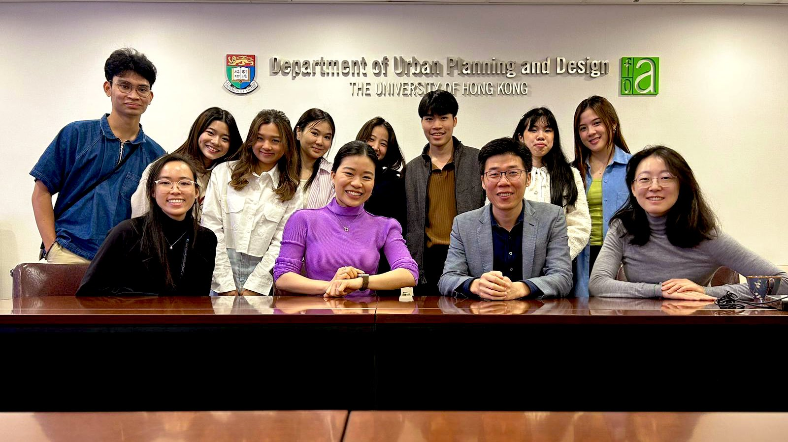

- Recently, uLab hosted and organized seminars within the university‘s institutions for **Prof. Tim Schwanen** from the University of Oxford, **Prof. Lauren Andres** from University College London, and Prof. Zhiji Huang from Central University of Finance and Economics. They had good discussions with the researchers and students after sharing their seminars.
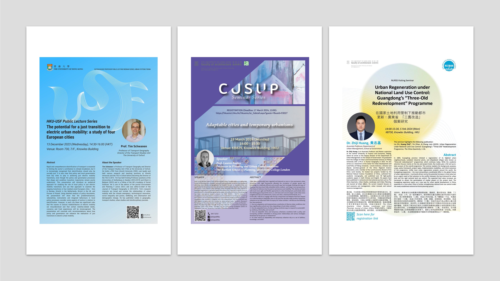
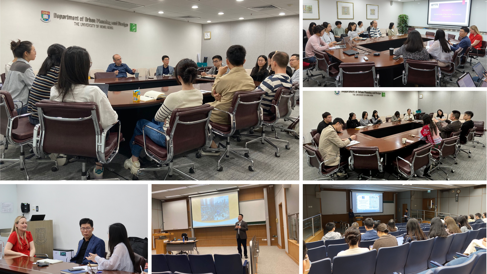

- On 8 January 2024, Guibo shared our project on **HKIS surveyors in the planning and development markets of Vietnam, Thailand, and Malaysia: Opportunities and Challenges**. Our findings have yielded seven strategies aimed at overcoming recognized obstacles and enhancing the capabilities of HKIS surveyors to fully unleash their potential in the planning and development markets of the three case countries. 
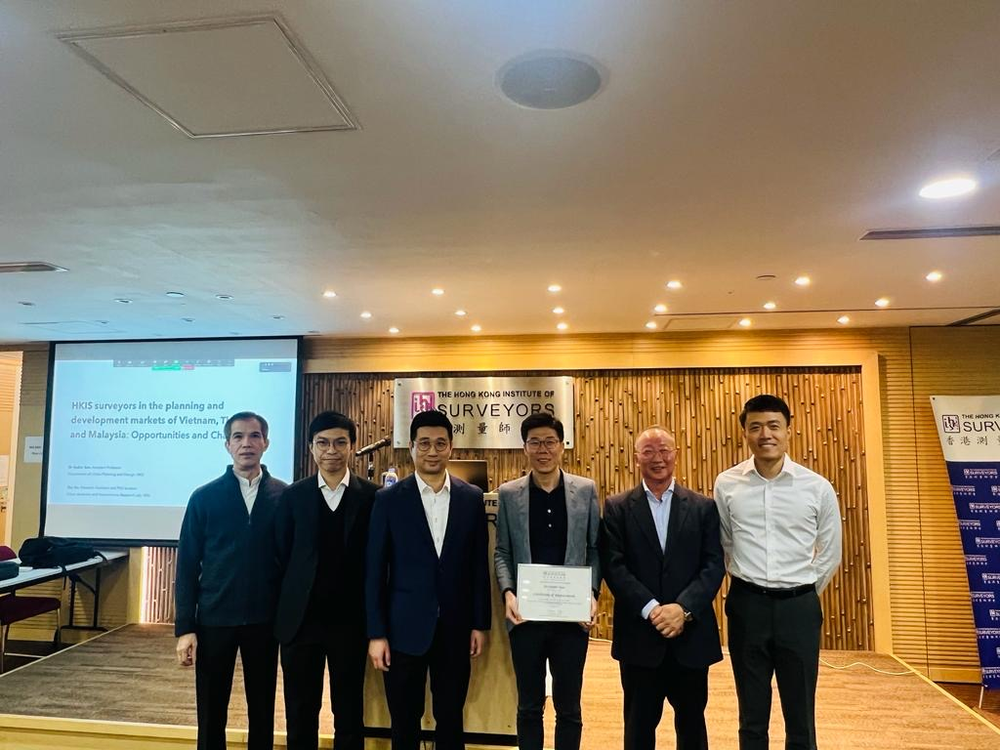

- We have a new paper published: Jianting Zhao, Guibo Sun, Chris Webster (2024). Understanding people-centric street transition: constructing a global geospatial database for pandemic-induced street experiments. **_Landscape and Urban Planning_**, 1-16. [doi.org/10.1016/j.landurbplan.2023.104931](doi.org/10.1016/j.landurbplan.2023.104931).
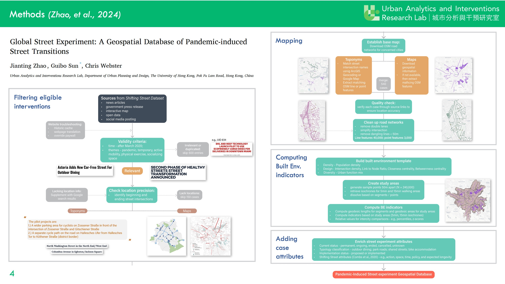

- Guibo Sun was a visiting researcher in the [Transport Studies Unit](https://www.tsu.ox.ac.uk/) at the University of Oxford from August to November 2023. During his stay, he gave a seminar on natural experiment studies in evaluating the economic and health effects of large-scale metro infrastructures, and conducted other academic exchange activities.
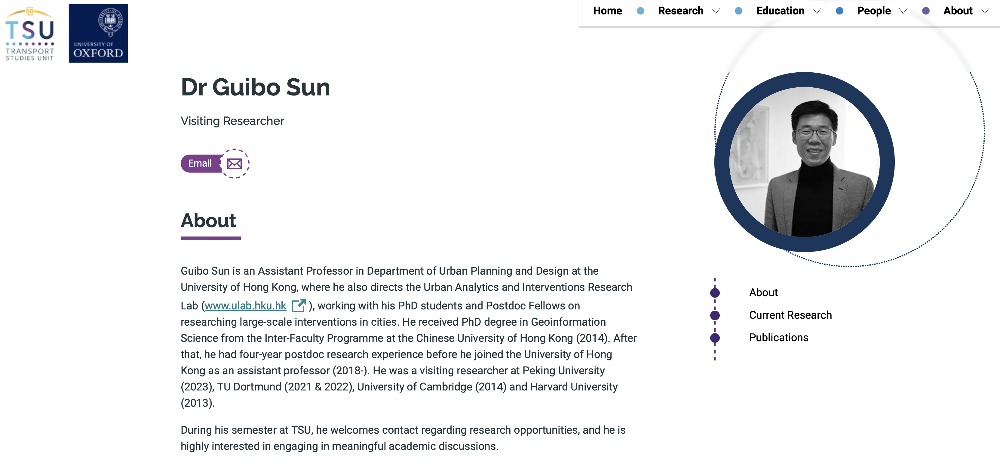

- Yao Du attended the **ACSP Annual Conference 2023** and presented her latest work on the causal pathways linking the new metro to eudaimonic well-being and the community’s efforts in creating supportive environments for older adults. 
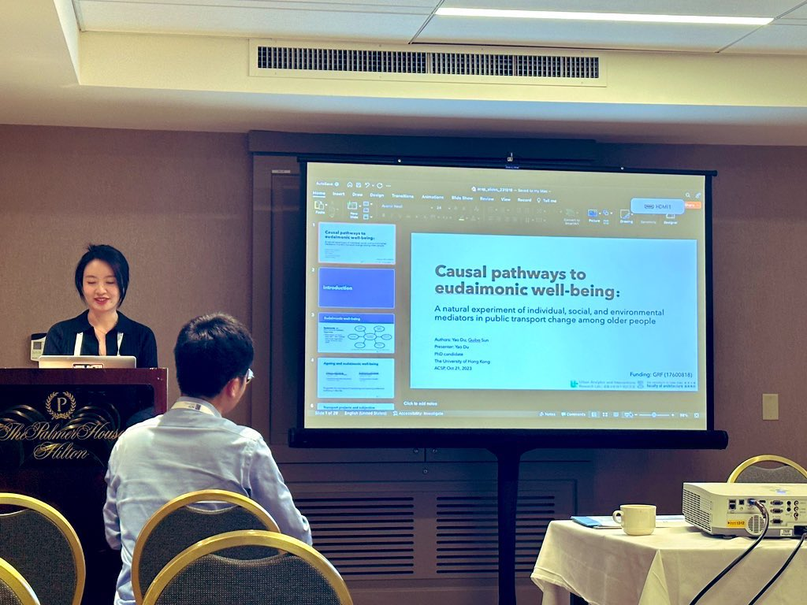

- On 9 November 2023, Guibo Sun was invited to give a seminar on “Evaluating the Social, Economic, Health, and Wellbeing Effects of Large-scale Metro Infrastructure Projects through Natural Experiments” in the Urban Big Data Center at the University of Glasgow.
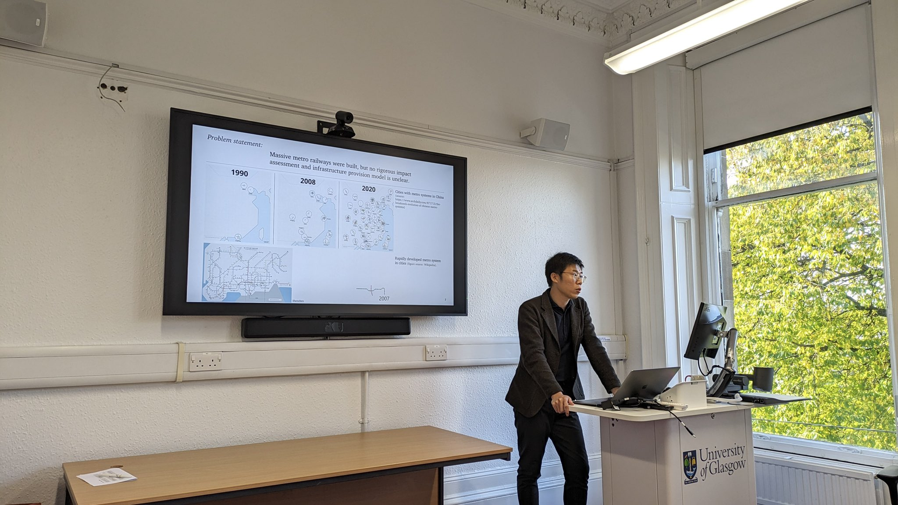

- On 16 October 2023, Guibo Sun attended the **Healthy City Design International Congress** in Liverpool. He presented his natural experiments studies on large-scale interventions in cities.
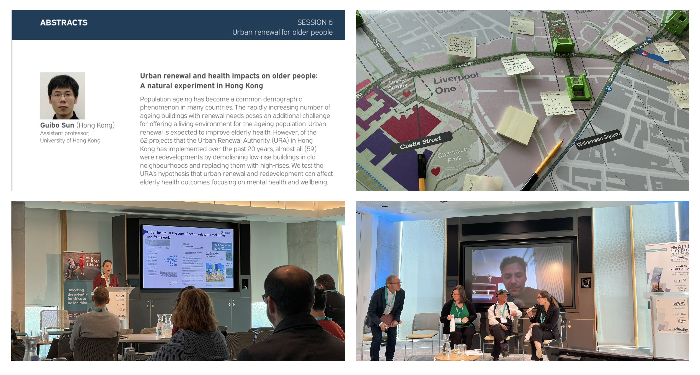

- We submitted our research report "Market Research for Hong Kong Planning and Development Surveyors in Belt and Road Countries: Case Studies of Vietnam, Thailand and Malaysia" to **The Hong Kong Institute of Surveyors**.
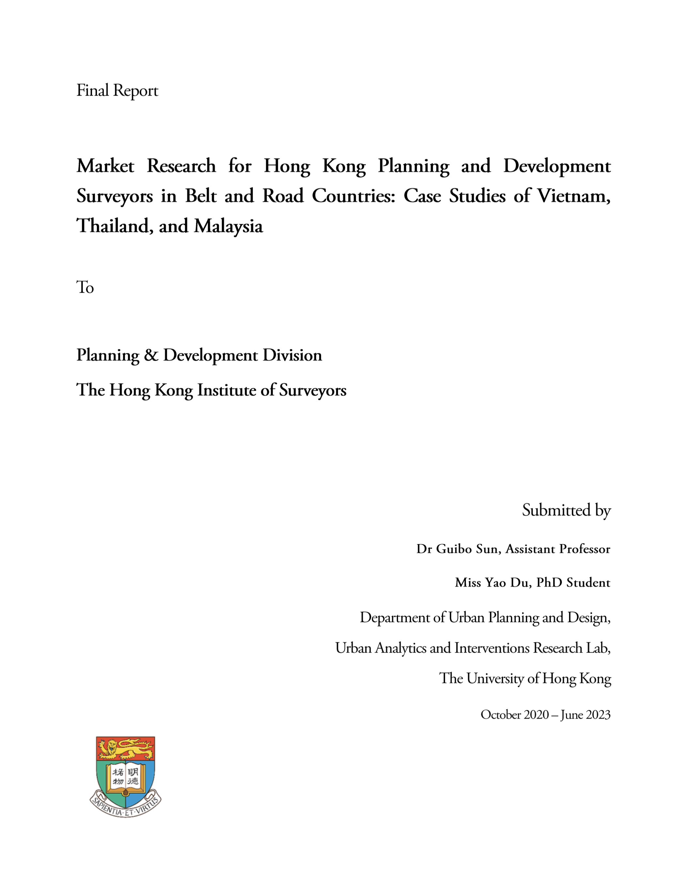

- Jianting Zhao presented her work Public Engagement Tactics in the COVID-19 Pandemic-Related Street Experiments in **PLATIAL'X** – International Symposium on Platial Information Science in September 2023 in Dortmund, Germany.  Guibo Sun chaired a session on place and mobility at the symposium.
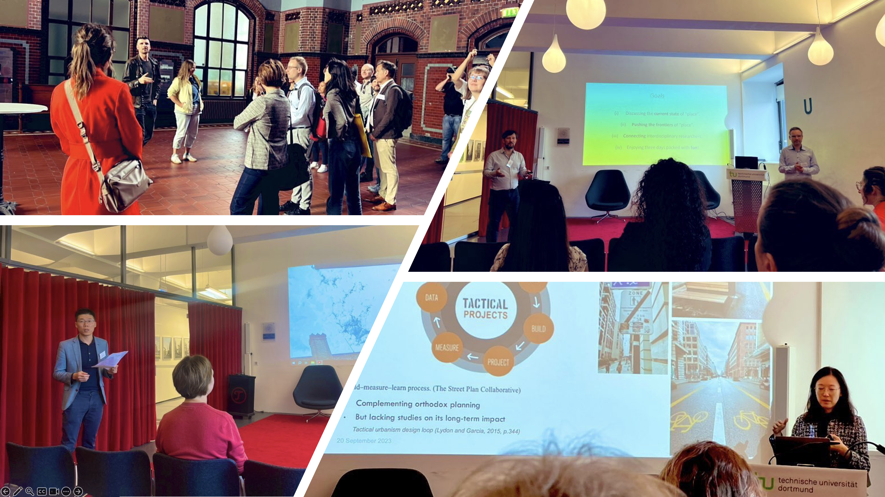

- In August 2023, Dongsheng has been shortlisted for **RTPI Early Career Researcher Award** for his work on using natural experiments to study the new metro's impact on walking and physical activity. Check out the paper: https://doi.org/10.1016/j.healthplace.2022.102939.
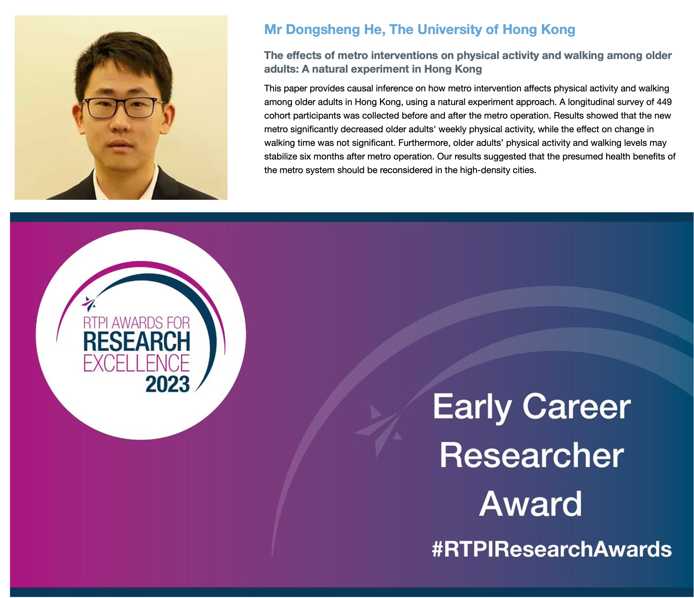