- On 6 March 2024, uLab hosted the visit of a group of researchers and students from **Chulalongkorn University, the INDA** [International Program in Design and Architecture](http://cuinda.com). We presented our lab and our latest global and local street experiment studies. We will continue the conversation in Bangkok during APSA2024! 

- Recently, uLab hosted and organized seminars within the university‘s institutions for **Prof. Tim Schwanen** from the University of Oxford, **Prof. Lauren Andres** from University College London, and Prof. Zhiji Huang from Central University of Finance and Economics. They had good discussions with the researchers and students after sharing their seminars.

- On 8 January 2024, Guibo shared our project on **HKIS surveyors in the planning and development markets of Vietnam, Thailand, and Malaysia: Opportunities and Challenges**. Our findings have yielded seven strategies aimed at overcoming recognized obstacles and enhancing the capabilities of HKIS surveyors to fully unleash their potential in the planning and development markets of the three case countries. 

- We have a new paper published: Jianting Zhao, Guibo Sun, Chris Webster (2024). Understanding people-centric street transition: constructing a global geospatial database for pandemic-induced street experiments. **_Landscape and Urban Planning_**, 1-16. [doi.org/10.1016/j.landurbplan.2023.104931](doi.org/10.1016/j.landurbplan.2023.104931).

- Guibo Sun was a visiting researcher in the [Transport Studies Unit](https://www.tsu.ox.ac.uk/) at the University of Oxford from August to November 2023. During his stay, he gave a seminar on natural experiment studies in evaluating the economic and health effects of large-scale metro infrastructures, and conducted other academic exchange activities.

- Yao Du attended the **ACSP Annual Conference 2023** and presented her latest work on the causal pathways linking the new metro to eudaimonic well-being and the community’s efforts in creating supportive environments for older adults. 

- On 9 November 2023, Guibo Sun was invited to give a seminar on “Evaluating the Social, Economic, Health, and Wellbeing Effects of Large-scale Metro Infrastructure Projects through Natural Experiments” in the Urban Big Data Center at the University of Glasgow.

- On 16 October 2023, Guibo Sun attended the **Healthy City Design International Congress** in Liverpool. He presented his natural experiments studies on large-scale interventions in cities.

- We submitted our research report "Market Research for Hong Kong Planning and Development Surveyors in Belt and Road Countries: Case Studies of Vietnam, Thailand and Malaysia" to **The Hong Kong Institute of Surveyors**.

- Jianting Zhao presented her work Public Engagement Tactics in the COVID-19 Pandemic-Related Street Experiments in **PLATIAL'X** – International Symposium on Platial Information Science in September 2023 in Dortmund, Germany.  Guibo Sun chaired a session on place and mobility at the symposium.

- In August 2023, Dongsheng has been shortlisted for **RTPI Early Career Researcher Award** for his work on using natural experiments to study the new metro's impact on walking and physical activity. Check out the paper: https://doi.org/10.1016/j.healthplace.2022.102939.

- In July 2023. Guibo attended the **Association of European Schools of Planning Congress** in Łódź, Poland. He shared the research on new metro and subjective well-being among older people. It was a natural experiment in Hong Kong. Among other activities, he contributed to the roundtable discussion on navigating planning theory.
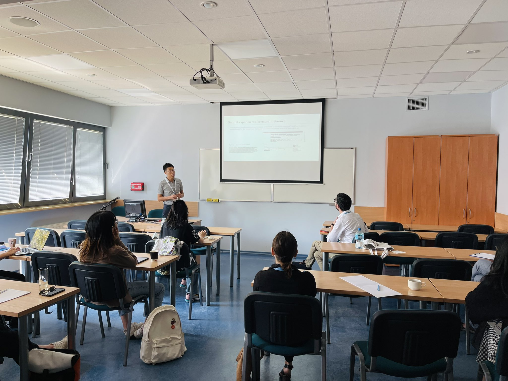
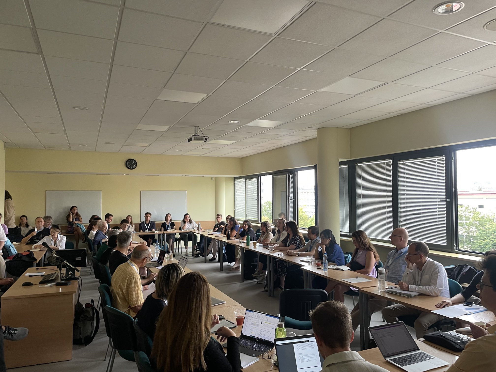

- In July 2023, Dongsheng attended **International Association for China Planning (IACP) Conference** in Tianjin, China. He shared our recent study regarding metro intervention and physical activity among older adults in Hong Kong.
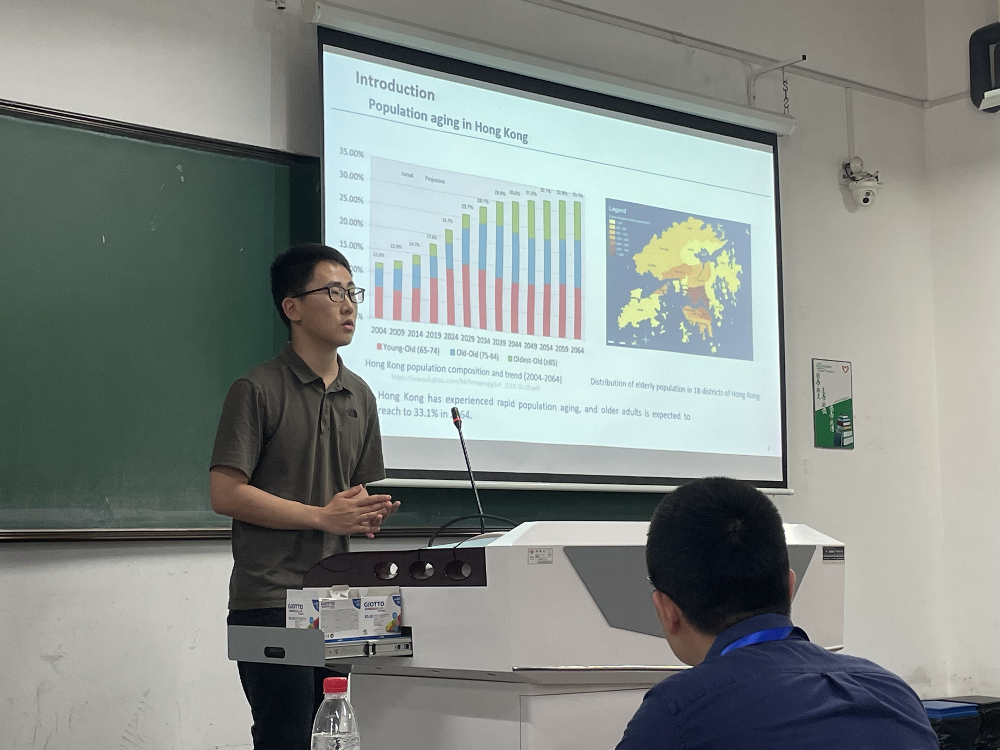
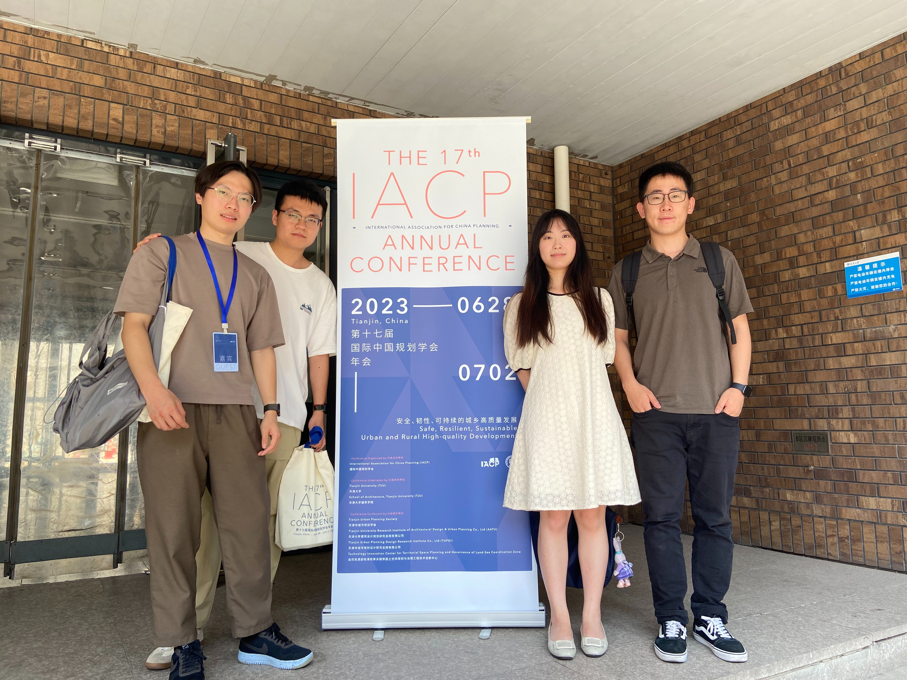

- In June 2023, Guibo gave a seminar at a seminar on natural experiments in transport infrastructure and impacts on healthy cities at Tsinghua University. During the seminar, he engaged in discussion with the audience on how planning and design knowledge can reinforce causal inference. 
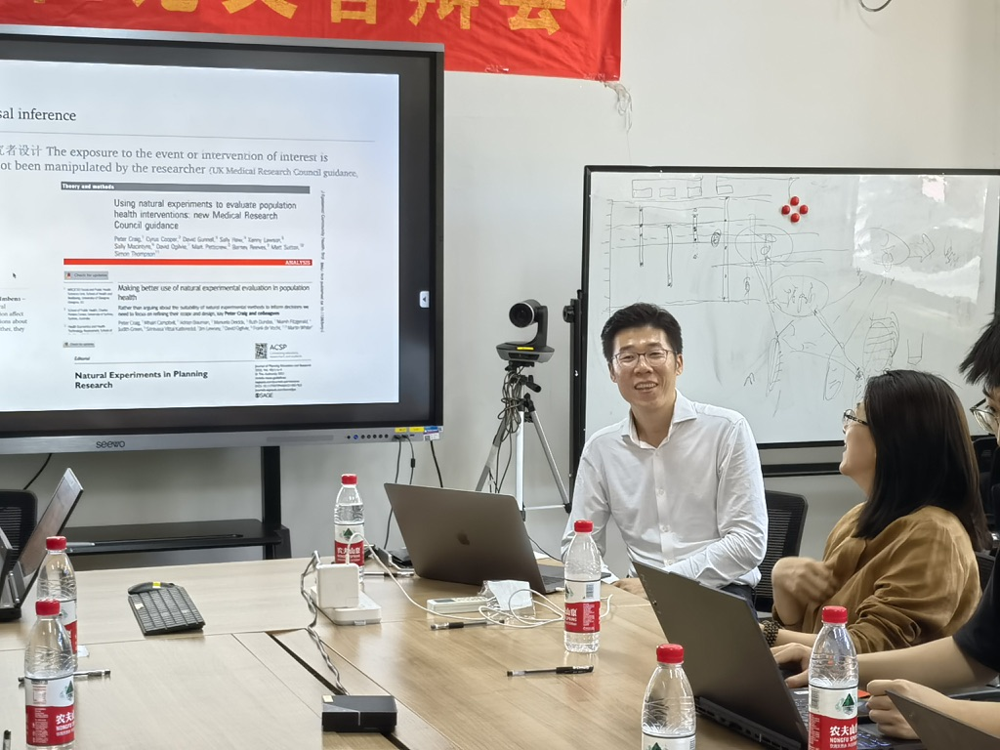
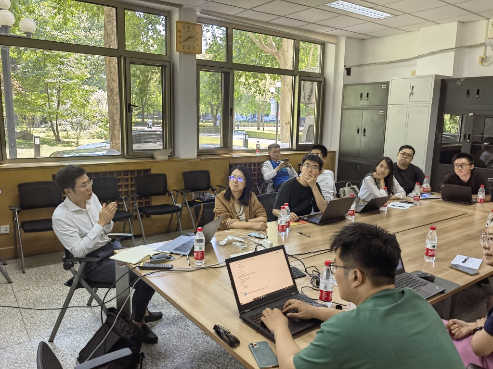

- In June 2023, Guibo gave a seminar at PKU-Lincoln Institute (PLC), on Evaluating the social, economic, health, and wellbeing effects of large-scale metro infrastructure projects through natural experiment. Apart from the seminar, he is visiting the PLC through June as a Lincoln Institute China Program International Fellow.
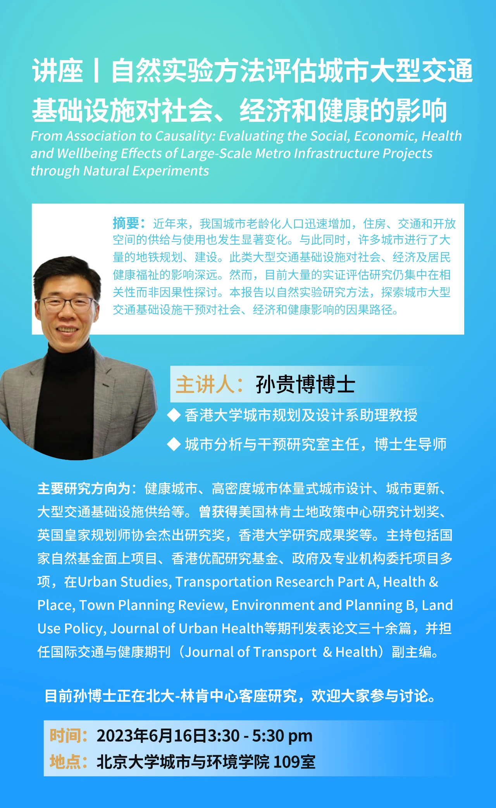
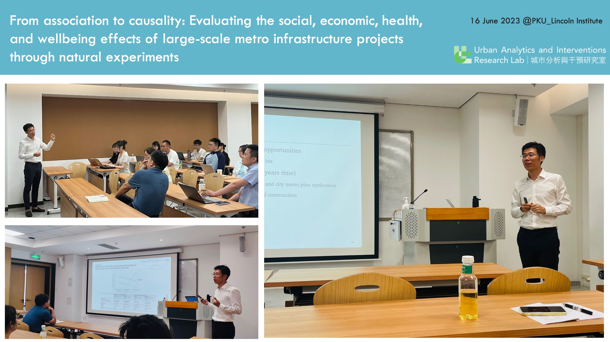

- In May 2023, our PhD student Dongsheng He attended [Planning, Law, and Property Right 17th Conference](https://www.plpr2023.com/) in Ann Arbor, Michigan, on May 1-5. He shared his ongoing project on metro intervention and housing values.
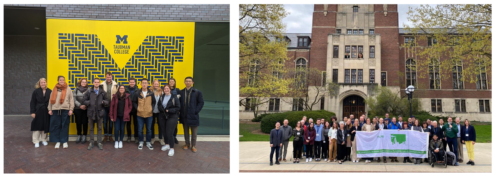

- In May 2023, Guibo Sun received HKU Overseas Fellowship Awards 2023/2024 (50,000 HKD). The University Research Committe established the HKU Overseas Fellowship Awards scheme to support ten academic staff of the University to visit overseas institutions for not less than one month to develop research links and academic exchanges.

- In April 2023, Guibo Sun gave seminars to Guangzhou Metro Cooperation and Nansha Design Institute on Volumetric Urban Design in Transit-oriented Development in Hong Kong. These are knowledge-exchange activities for his project on "Methodologies for assessing specific social, economic, health and wellbeing impacts of volumetric urban designs of metro infrastructure projects in the Greater Bay Area" (Seed Funding for Strategic Interdisciplinary Research Scheme, 2022.06-2025.06).

- In March 2023, Jianting Zhao attended AAG Annual Meeting 2023 in Denver, Colorado. She presented her working paper on “Public-initiator interactions in the tactical approach of street experiments as a pandemic emergency response”.
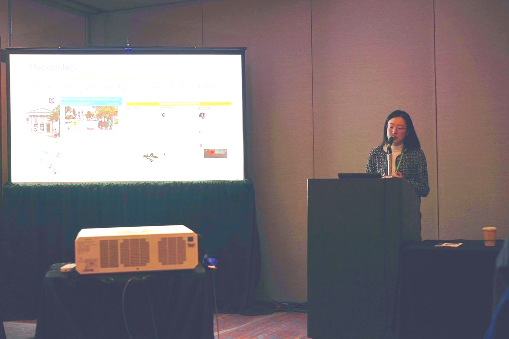

- March 2023. We are organising a special issue in Journal of Transport & Health, looking for papers on Asian cities that discuss urban planning and design contexts, transport infrastructure provisions, and healthy ageing. We welcome your submission! 
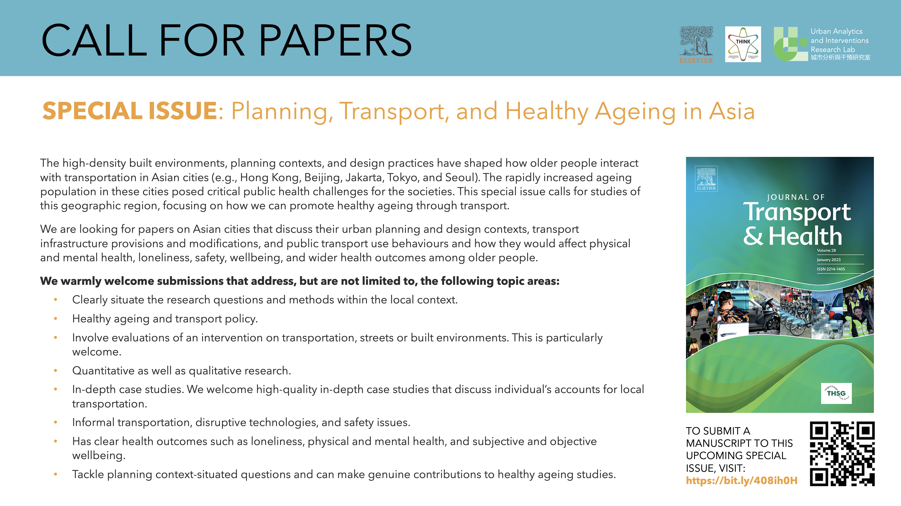

- Feb 2023. ​Guibo Sun was awarded the **Lincoln Institute China Program International Fellowship**. His proposed research on gated communities and metro-created accessibility was selected from global applications through a competitive evaluation process. The fellowship is US$35,000 for starting from 01 March 2023 to 31 May 2024.
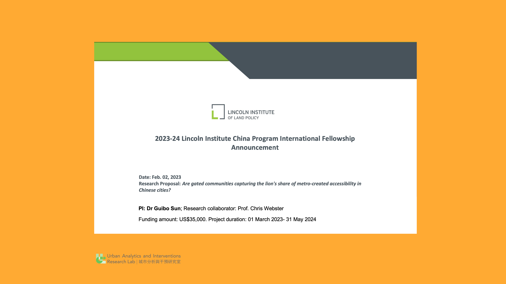

- Feb 2023. Guibo Sun and Yao Du published a paper on **_Transportation Research Part A: Policy and Practice_** titled "New metro and subjective wellbeing among older people: A natural experiment in Hong Kong". https://doi.org/10.1016/j.tra.2023.103592
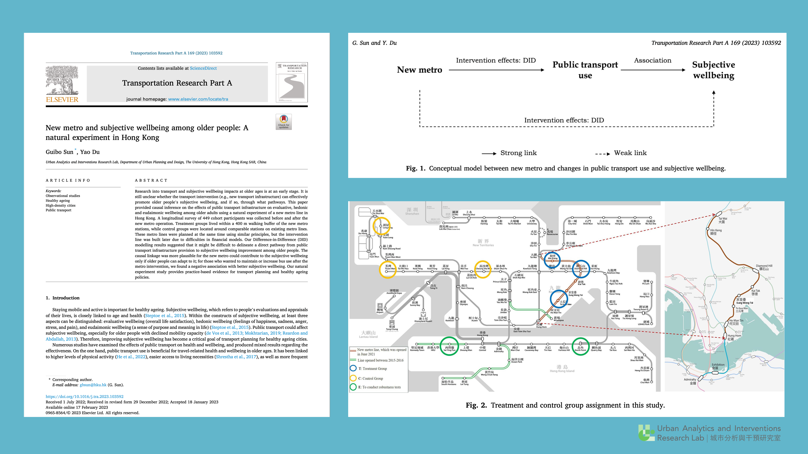

- Feb 2023. Guibo Sun gave a seminar to **UCL CASA** on "Methodologies for assessing social, health and wellbeing impacts of urban interventions in high-density cities."

- Jan 2023. Dr Eun Yeong Choe, Dongsheng He and Dr Guibo Sun published a paper in the **_Journal of Urban Health_**. This study used a natural experiment of a new metro line in Hong Kong to examine trade- offs between transit-related and non-transit-related physical activity (PA) among 104 older people based on longitudinal accelerometer data that distinguished transit-related and non-transit- related PA. 
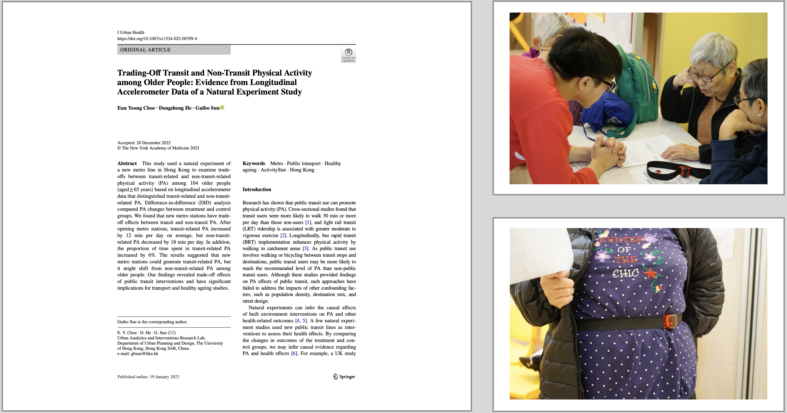

- Jan 2023. Dr Guibo Sun received an invite from the Journal of Transport & Health at Elsevier to be an [Associate Editor](https://www.sciencedirect.com/journal/journal-of-transport-and-health/about/editorial-board). Journal of Transport & Health is a flagship journal in its field and brings researchers close to some of the most exciting research developments in transport and health. He started the role of associate editor in 2023. 

- Jan 2023. Our paper on "natural experiments in healthy cities research" became a [Featured Article](https://liverpooluniversitypress.blog/2023/01/16/featured-in-town-planning-review-94-1-natural-experiments-healthy-cities-research/) in Town Planning Review. The editorial team have selected this article as a particularly influential piece from this year’s volume, and, as such, they would like to highlight it via a feature on their blog and make it free to read for a limited period. 

- Jan 2023. Guibo Sun gave a seminar at [Pt.Talks](https://www.pt.rwth-aachen.de/cms/PT/Forschung/Pt-Talks/~coqhw/Pt-Talks-Events/lidx/1/) at Chair of Planning Theory and Urban Development, RWTH Aachen University. 

- December 2022. Our paper in the **_Journal of Transport and Land Use_** is online! We found older people prefer "bus + metro" rather than metro-dominated travel mode, and mixed-mode benefits physical and mental health. It challenges TOD design in Asian cities, where metro is developed as the public transport system but bus service is often overlooked. https://jtlu.org/index.php/jtlu/article/view/2152

- Guibo Sun received the **Faculty Teaching Award 2022** from the Faculty of Architecture at HKU. The Panel was impressed with the awardee’s "dedication to teaching, and innovative pedagogical approaches to enduring excellence to enhance student learning experiences and learning outcomes". His teaching creates a two-way connection with research in the uLab.

- December 2022. We have a paper published in **_BMC Public Health_**. The study addressed how active mobility changed among a study cohort of older people during the pandemic, the role of neighbourhood built environment, and what we could do for post-pandemic transport planning. https://doi.org/10.1186/s12889-022-14780-8.

- November 2022. We have a natural experiment study published in **_Health & Place_**. This paper provided causal inference on how a new metro line affects moderate-to-vigorous physical activity and walking among older adults in Hong Kong. https://doi.org/10.1016/j.healthplace.2022.102939.

- November 2022. Urban Analytics and Interventions Research Lab has jointly hosted two peer talk sessions, with NURSS (New Urban Researchers' Seminar Series) in October and November. The peer talk aims to strengthen the academic exchange among PhD students.    We featured Víctor Cobs-Muñoz on Environmental justice and place: Creating a framework proposal to approach social-ecological Sacrifice Zones and Liudmila Slivinskaya on Reading Urban Form of Housing Estate through Place, respectively. Both are PhD students from TU Dortmund University. With backgrounds in Chile and Belarus, the two speakers carried their cultural roots into their research interests, which made the talks unique for Hong Kong-based doctoral researchers.  The academic exchanges are funded by the DAAD/RGC Joint Research Scheme (G-HKU703/20).

- October 2022. We are hosting two visiting PhD students from TU Dortmund, Victor Cobs-Munoz and Liudmila Slivinskaya. They share PhD research projects as peer talks to exchange research ideas with PhD students in Department of Urban Planning and Design at HKU. Their academic visits are supported by RGC/DAAD Hong Kong Germany joint research funding.

- September 2022. A paper published in the **_Town Planning Review_** on "Natural experiments in healthy cities research: How can urban planning and design knowledge reinforce the causal inference?" We aim to contribute to a highly intellectual debate about a very important topic in healthy cities research. https://doi.org/10.3828/tpr.2022.14

- Guibo Sun will give a seminar at RAM, Department of Spatial Planning at TU Dortmund on 28 July 2022 on the topic of new metro and subjective wellbeing among older people, to share findings from his natural experiment study in Hong Kong. 

- Guibo Sun received a 3-year funding award to explore "Methodologies for assessing specific social, economic, health and wellbeing impacts of volumetric urban designs of metro infrastructure projects in the Greater Bay Area" (Seed Funding for Strategic Interdisciplinary Research Scheme, 2022.06-2025.06, 1 million HKD)

- July 2022. A paper is published in Journal of Public Health and Emergency. Using RCT, this study explored the potential for enhancing the effectiveness of an intervention by combining it with exposure to a natural environment on stress-related symptom. https://jphe.amegroups.com/article/view/8469/pdf.

- June 2022. PhD student Dongsheng He published a paper in Landscape and Urban Planning. Based on natural experiment approach, he investigated whether and how greenway intervention affects body weight outcomes. https://doi.org/10.1016/j.landurbplan.2022.104502.

- April 2022. We have a paper published in the Journal of Transport & Health to answer the  question of "To what extent can social isolation explain the association between public transport use and wellbeing?" https://doi.org/10.1016/j.jth.2022.101378.

- PhD student Dongsheng He received 20,000 HKD additional funding from RGC for supporting his research needs (e.g., data, high-computing power) as an HKPF awardee.

- A joint paper is published in Urban Design International with Dr Gianni Talamini and his team at CityU on "The controversial impact of pedestrian guardrails on road crossing behaviours. Evidence from Hong Kong". We conducted a before-and-after observational study of the temporary removal of guardrails in Hong Kong, to explore the controversial issue "Are pedestrian guardrails for pedestrian safety or speeding up cars?" https://doi.org/10.1057/s41289-022-00184-y.

- On 20th March 2022, our paper "Does China-Pakistan Economic Corridor improve connectivity in Pakistan? A protocol assessing the planned transport network infrastructure" was published in the Journal of Transport Geography. https://doi.org/10.1016/j.jtrangeo.2022.103327.

- On 8th March 2022, our lab and Centre of Urban Studies and Urban Planning (CUSUP) co-hosted a research seminar on transport and health. Details please see the poster.

- Jan 2022. PhD student Dongsheng He published a paper in Cities, he investigated whether and how urban density influences the life satisfaction of older adults in Shanghai, China.

- Dec 2021 - PhD student Dongsheng He published a paper “Examining non-linear associations between built environments around workplace and adults' walking behaviour in Shanghai, China” on Transportation Research Part A. https://doi.org/10.1016/j.tra.2021.11.017.   He also received the Hong Kong Presidential PhD Scholarship and attended the award ceremony.

- Dr Eun Yeong Choe has recently published a paper “ Examining the effectiveness of mindfulness practice in simulated and actual natural environments: secondary data analysis” at **_Urban Forestry & Urban Greening_**. Please find the link to the article: https://authors.elsevier.com/a/1e7QG5m5d7s1k0.

- PhD student Yao Du and Dr Eun Yeong Choe gave presentations at the **APRU Global Health Conference**. 
  1. Yao Du - "The differences in the elderly’s travel behaviour during the COVID-19 pandemic: Metro and health cohort study in Hong Kong"
  2. Dr Eun Yeong Choe – "The role of natural environments in the effectiveness of a mindfulness-based stress reduction (MBSR) programme: Psychological and physiological responses to stress".

- PhD student Dongsheng He has published a paper “Large-scale greenway intervention promotes walking behaviors”. In this natural experimental study, he assessed the effects of new greenway on the residents’ walking behaviors in Wuhan, China.

- PhD student Dongsheng He joined the lab in September 2021. Dongsheng is an awardee of **HKPF** and **HKU-PS**, a prestigious scholarship package for outstanding full-time PhD students studying in HKU.

- On 3 August 2021, Jianting Zhao is shortlisted by **RTPI Early Career Researcher Award** for her entry: Zhao, J., Sun, G. Webster., C. Walkability scoring: Why and how does a three-dimensional pedestrian network matter? Urban Analytics and City Science (2020). 

- On 30 June 2021, Dr Jiangping Zhou, Dr Zhan Zhao and Dr Guibo Sun co-organised **HKU-University of Glasgow Urban Analytics Symposium**. It was a faculty network building event, where active researchers in urban analytics at UoG and HKU discussed ongoing work and future plans to identify mutually interested areas to build up future research collaborations. 

- On 20 May 2021, Dr Guibo Sun was invited by the Hong Kong Institute of Surveyors to give a talk on the topic of **"The Making of Hong Kong: 3D Pedestrian Network as the Critical Urban Infrastructure"**.