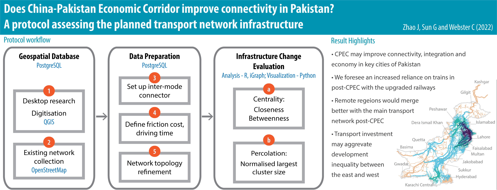

There is no clear protocol for quantitatively assessing connectivity impacts of mega transport infrastructure projects designed to reconfigure the transportation networks of entire regions and sub-continents. We developed a protocol that uses open-source data and tools to complete the analysis, starting from data acquisition, network preparation, to the analyses of centrality (accessibility) and percolation (agglomeration). We tested our protocol on the China-Pakistan Economic Corridor (CPEC), the flagship project of China’s Belt and Road Initiative. We found that the CPEC outcomes will be mixed, improving connectivity and economic growth for key cities but widening development inequality. The benefits of our protocol are threefold. First, it extends the existing literature by providing a quantitative method for estimating the importance of new transportation networks brought by BRI. Second, it can be replicated to different scales and locations with easy-access open data. Third, the processing platforms we use are all open source, making it accessible for local governments and analysts in resource scarcity typically found in BRI projects. The protocol can be adopted by the government, academic, funding, private, and community stakeholders to effectively assess BRI-related investments.  

#### Assessing China-Pakistan Economic Corridors (CPEC)
CPEC plans to upgrade and construct a series of road and rail linkages to better connect northern Pakistan and seaports in the south. These linkages enable faster transport of goods from Kashgar, Xinjiang, China to other continents via the Gwadar. 

#### Network Analysis
We conducted centrality and percolation analyses to quantitatively evaluate the changes of the post-CPEC network. Closeness centrality measures the average distance from one link to the rest of the network in a given range; betweenness centrality measures the weight of the shortest path that passes through a link. Percolation examines the network agglomeration with different thresholds.

#### Results
Results show that the eastern regions are predicted to benefit from CPEC projects, with shortened average distance and more shortest paths. Yet, the connectivity remains stagnant in western regions. Eastern Pakistan has already been more prosperous than the west, and thus the limited development in the west leads to concern of widened gap in development inequality. 

### Project Outputs

- [Does China-Pakistan Economic Corridor improve connectivity in Pakistan ? A protocol assessing the planned transport network infrastructure]( "academic publication")

_This project is funded by the HKU Seed Fund for Basic Research, **Assessing Transport Infrastructure Development in Belt and Road Initiative: Development of a Protocol for Connectivity Impact Analysis** (2019.03-2021.03)._ 
{style="color: grey"}