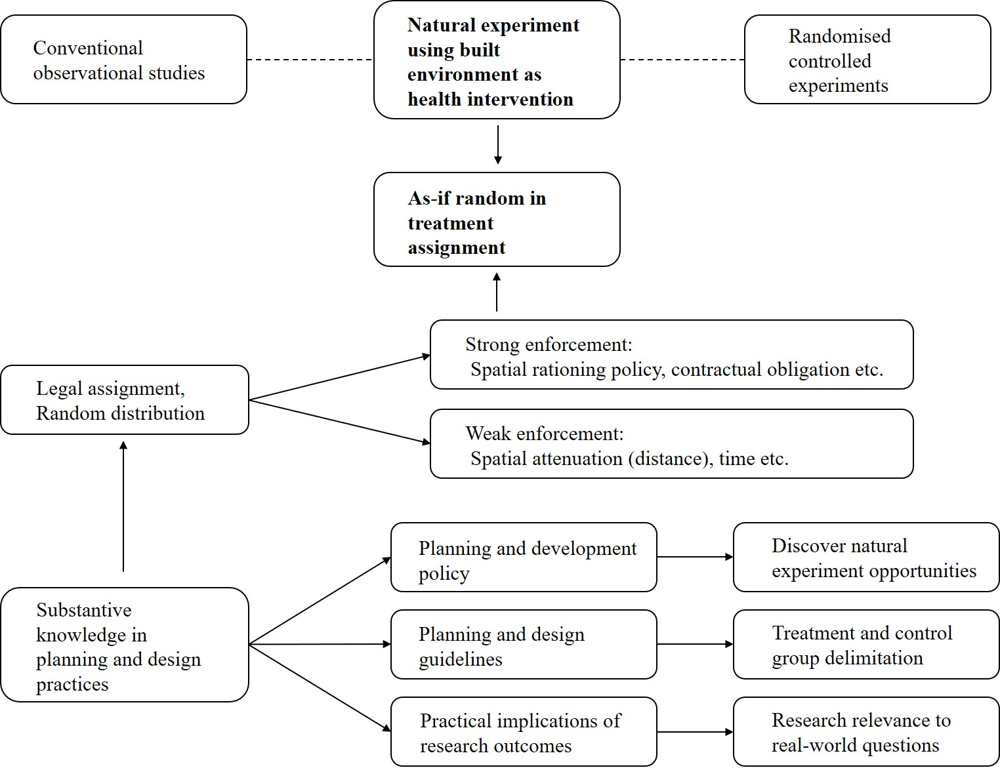

There is a growing interest in using natural experiments for causal inference, considering how built environment changes brought by urban planning and design practices can be structured as health interventions. Without randomisation in intervention exposure as a randomised control experiment does, the challenge of natural experiments for inferring causality lies in validating approximate random distribution of confounding effects between treatment and control groups. 

The experimental logic based on substantive knowledge of the intervention, mainly from a qualitative method, is a key to achieving as-if random treatment assignment. The classic natural experiment could date back to Dr. John Snow's London cholera study. The 1854 relocation of the Lambeth Water Company's intake pipe to an upstream location to secure cleaner water was used as the naturally occurring intervention. Cholera infections in the treatment group were compared with a control group of people using Southwark and Vauxhall Water Company's water intake left on a sewage-polluted stretch of the Thames. Later literature reported that Snow compared the two groups' cholera death rate using simple statistics in the data analysis stage, including an early manual example of point mapping. But what is less reported is that Snow made great effort to use substantive knowledge of the water supply market and individual cholera cases to validate the as-if random treatment assignment. Snow noted, for example, that the two water companies were competitors in the same market, both having customer bases ranging from poor to rich and from small subdivided apartments to large houses. Customers of the two companies could even be neighbours in the same street. After customers committed to using one water company's services, they were unlikely to switch suppliers after the water intake relocation because the water pipe infrastructure connected to individual houses was bespoke to the company. Note that at that time, cholera was widely believed to be transmitted by "bad air", not by water. The difficulty in switching suppliers strengthened the natural experiment by removing possible interference between the two groups. 

These strenuous as-if random assignment validations using substantive knowledge of the interventions in research design stage enable simplicity and transparency in Snow's later data analysis. Unfortunately, the central role of substantive knowledge in making causal inferences seems to be still missing in most natural experiments in built environment and health studies. Instead, most research uses natural experiments relied on mathematical complex, in which confounding bias from unobservable but essential factors may distort the observed health effects. 

This motivates us to build a conceptual model to demonstrate that how substantive knowledge from urban planning and design practices can help discover natural experiments in as-if random pursuit, delimit treatment and control group, and align the research with real-world relevance, in order to infer causality of health effects of built environment. We elaborated on the principle further as legal assignment of treatment and control groups and random distribution of confounders (LARD principle).

### Project Outputs

[Natural experiments in healthy cities research: How can urban planning and design knowledge reinforce the causal inference?]( "academic publication")