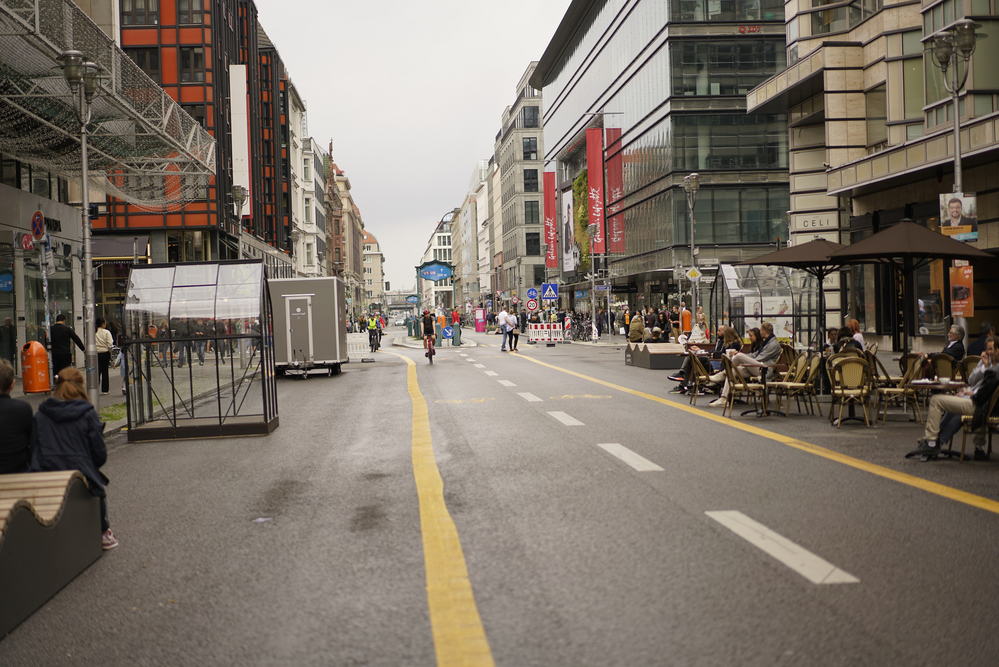
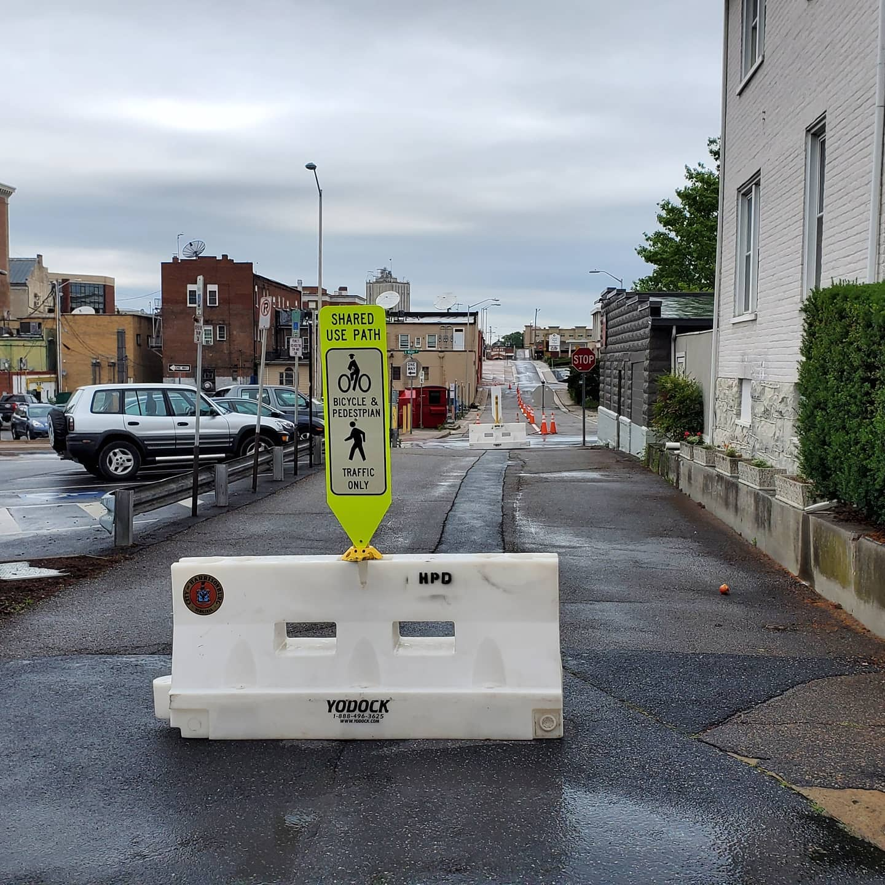

Orthodox planning envisions the city by spatial planning, land-use zoning and infrastructure provision. It operates on a large scale, with big budgets and expansive teams to deliver substantial and permanent infrastructure that signals particular land use. It deploys predictive projects to inform decisions about motorways, industrial zones, shopping centres and housing development. It usually aligns with aspirations such as sustainability, liveability and resilience, to invite broad support.

Cities certainly need orthodox planning. But cities nowadays are also facing an era of rapid change, crises and disruptions, and ever-increasing informal and unofficial practices. Orthodox planning has difficulties in addressing these challenges because of the long timeframe (e.g., 20 years), translation issues in statutory and non-statutory regulations, and loss of control in implementation due to the diversity of stakeholders and forces. Against this background, tactical urbanism is emerging as a different school of thought. It uses short-term actions that prototype planning and design ideas of our buildings, streets and neighbourhoods, aiming to inform long-term changes in urban development. It includes distinctive works, ranging from do-it-yourself urbanisms and place activations to those government-endorsed, supported or even initiated projects. However, the application of tactical urbanism was mainly limited to small scales and specific locations.

During the COVID-19 pandemic in 2020, cities worldwide took a tactical urbanism approach, temporarily converting car-centric city streets into streets for walking, cycling, outdoor dining and commerce, responding to the demand for safe, physically distanced outdoor activities. On a global scale, these street experiments offer us a window of opportunity to rethink planning and re-envision the future city. What can we learn from the global tactical urbanism phenomena? This project will study the evolutionary logic of street experiments. This research may help academic researchers, architects, urban planners, health professionals, and the public during and after the pandemic.

### Project Outputs

- [Global Street Experiment: A Geospatial Database of Pandemic-induced Street Transitions]( "academic publication")

_This project is funded by HKUrbanLabs (2021.07-2024.07) and the Research Outout Prize (2022.01-2023.01)._ 
{style="color: grey"}