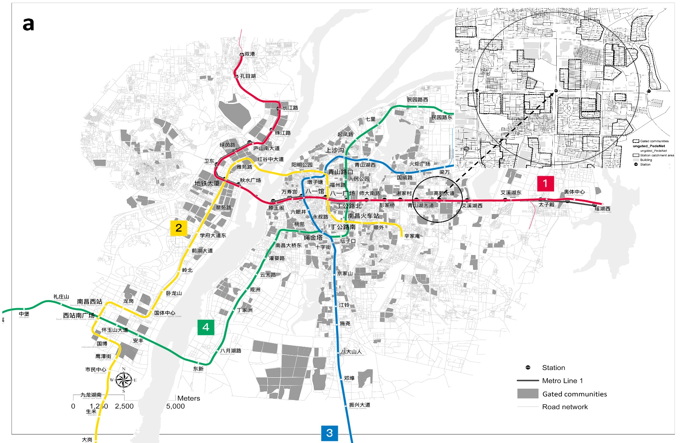

New metro, suburbanization, and housing redevelopment have become dominant urban development in China in past decades. However, little research has been done to examine how the metro infrastructures are shaping Chinese cities. Most studies confine their analysis to transportation issues such as traffic congestion. These studies might overlook the financial conditions of metro infrastructure and the far-reaching consequences on the cities' spatial, economic, and social dimensions. Infrastructures should be critically examined as highly contested terrain rather than technological artefacts and systems. In North American cities, the impact of urban rail transit has been discussed with gentrification and displacement. In China, metro infrastructure combines suburbanisation and city centres' redevelopment. The numerous new towns aimed to use the new metro to facilitate a booming land and housing market. In old neighbourhoods in the city, the metro was expected to bring opportunities to modernise the built environment, open up a new space to expand capital accumulation and sustain investment. 

This project investigates the mechanisms by which gated communities are in danger of capturing metro-created accessibility benefits better in Chinese cities. A city with large-block gated communities that co-evolved with metro lines may lead to land use inefficiency, low transit usage, and social inequality. Using Guangzhou and Nanchang as case cities, we will delineate the mechanisms in urban governance, examining how the gated community and land development might reinforce each other and if metro infrastructure functioned as the nexus. The findings will provide policy insights by tackling land, housing, and infrastructure provision issues concerning metro infrastructure and gated communities that will continue to shape Chinese cities in the coming decades.

### Project Outputs

- [Are Gated Communities Capturing the Lion’s Share of Metro Accessibility?]( "working paper")

_This project is funded by Lincoln Institute of Land Policy, **Are gated communities capturing the lion's share of metro-created accessibility in Chinese cities?** (2023.03-2024.05)._ 
{style="color: grey"}