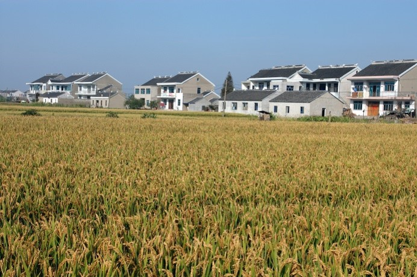

Many older people in rural areas have lived in their homes most of their lives. They know the neighbours, shops, and sitting areas. But instead of enjoying the familiarity and security of their surroundings, some are being uprooted in their twilight years to make way for new developments, and relocated to suburbs of Chinese cities. 

Using a natural experiment in Suzhou, China, we study the physical and mental effects on farmers forced to move due to development that changes rural environments to new towns, measuring the health impacts of alternative designs. Baseline surveys have been administered to more than 2,600 elders, including a control group still living in their village, and health information was collected. The first part of the study was completed in November 2019, follow-ups were conducted in 2020 and 2021, and yielded rather depressing preliminary results: relocated patients had statistically higher hypertension levels and were more likely to be overweight. 

Our project aims to improve the livings of the relocated residents by looking at the built environmental features for their mental, physical and social outcomes. For example, what are the effects of planting greenery outside their buildings, installing facilities for them to exercise, sit and socialise, or placing roads away from these public places? 

These strenuous as-if random assignment validations using substantive knowledge of the interventions in research design stage enable simplicity and transparency in Snow's later data analysis. Unfortunately, the central role of substantive knowledge in making causal inferences seems to be still missing in most natural experiments in built environment and health studies. Instead, most research uses natural experiments relied on mathematical complex, in which confounding bias from unobservable but essential factors may distort the observed health effects. 

This motivates us to build a conceptual model to demonstrate that how substantive knowledge from urban planning and design practices can help discover natural experiments in as-if random pursuit, delimit treatment and control group, and align the research with real-world relevance, in order to infer causality of health effects of built environment. We elaborated on the principle further as legal assignment of treatment and control groups and random distribution of confounders (LARD principle).

> This project is funded by the National Natural Science Foundation of China (NSFC), _Elderly-friendly environment making during rapid urbanisation: A longitudinal study of the impact of the built environment on health_ (2018.09-2021.12).