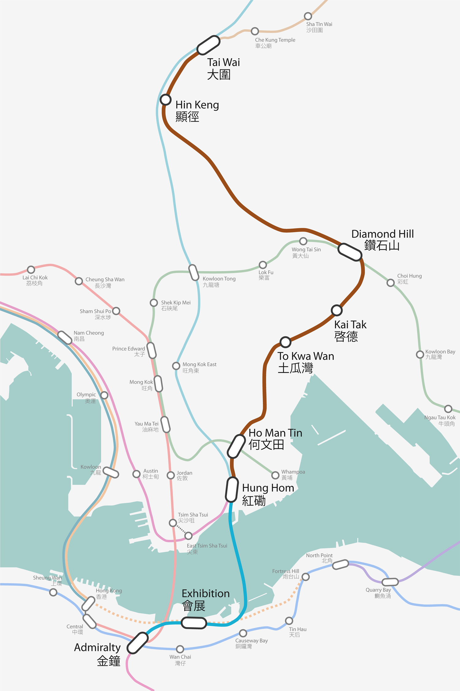

Public transport use may influence the physical activity, social inclusion and wellbeing of the elderly. However, previous studies on public transport use and elderly health were mostly observational studies using cross-sectional data. Few studies have examined the before-and-after effects of a new metro, for example, to see if it leads to improved elderly health.

We use a new metro line in Hong Kong as a natural experiment to examine the impact of the metro-led public transport intervention on elderly health. In Hong Kong, more than 90% of daily travel are made by public transport. The public transport modifications consist of the new metro line with eight stations and changes in the walking environment and bus services around the stations. We look at the before-and-after differences in public transport use and health outcomes between elderly participants living in treatment neighbourhoods (400m walking buffered areas of the new metro stations) and in control groups (living in comparable areas but unaffected by the new metro).

We aim to investigate if the new metro and the associated changes in the built environment affect public transport use behaviours, physical activity and wider health outcomes among the elderly (e.g., social inclusion, quality of life, subjective wellbeing). Questionnaire-based baseline data were collected in 2019 before the COVID-19 pandemic, while some qualitative interviews are ongoing. Amid the pandemic, we conducted a quick telephone-based survey of COVID-19’s potential impact on public transport use behaviours of our elderly cohort in September 2020. Note there is no lockdown in Hong Kong. The new metro was opened in July 2021, and we are conducting a follow-up survey.

> #### Strengths and limitations
> - This study will investigate how the new metro and the associated changes in the built environments can be used as a source of public health interventions for older people.
> - We explore a more specific set of research questions linking the new metro and the associated changes in built environment with public transport use, physical activity and wider health impact among the elderly cohort in a high-density city. 
> - Our natural experiment research design with multiple treatment–control groups will provide robust estimates of the health impact of public transport.
> - Although the natural experiment research design is insightful, this type of large-scale study may encounter financial and time constraints due to risk of postponement and other uncertainties (eg, COVID-19) during the infrastructure modifications; hence, research design needs to be adaptive.

### Project Outputs

- [Metro and elderly health in Hong Kong: Protocol for a natural experiment study in a high-density city]( "academic publication")

_This project is funded by the General Research Fund (GRF), **Public transport use and health impacts on the elderly: a natural experiment in the high density built environment of Hong Kong** (2018.08-2022.06)._ 
{style="color: grey"}