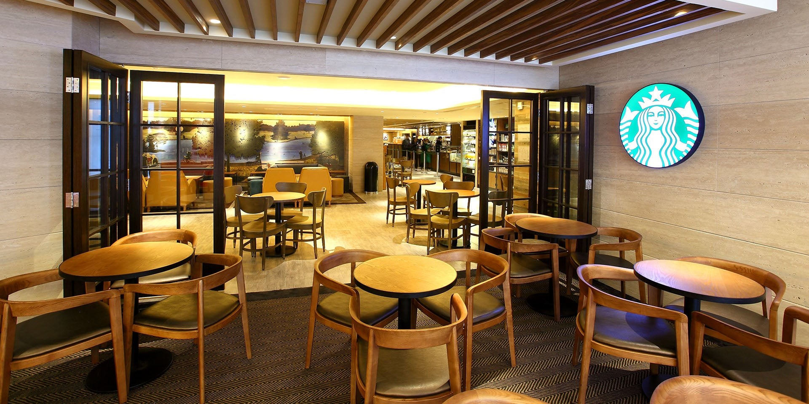

Well-designed urban space is what economists call a ‘public good’. One way of achieving more supplies of high-quality urban spaces would be to attach a price to urban design benefits. In this project. we explore the possibilities of ‘pricing’ urban design in metro station areas to increase the supply of more high-quality urban spaces in high-density cities. By ‘pricing’, we mean charging beneficiaries, directly or indirectly, via transactions that capture the value of urban design. Many stakeholders, such as local government, transit agencies, real estate developers, and residents, create and benefit from high-quality station areas. However, the metro station area is consumed by many people and therefore is difficult to price. But if the urban design in the station areas could be priced, it could be provided and allocated more efficiently. Thus, pricing could recover the costs of design-enhancing investment and lead to the supply of more high-quality urban spaces around metro stations. It could, in this way, induce a more efficient allocation of resources, as money-capital owned by an individual or a group of individuals, is turned into high-quality urban spaces that benefit the many.

> We like the analogy of Starbucks and similar innovators, who discovered how to price ‘comfort’ into a cup of coffee and thereby deliver a major innovation that helped draw pedestrians back to the city centres: private leather-arm chair filled lounges, with rental for seating priced into the coffee. How might we similarly create a revolution in how high-quality urban space is supplied in our cities in a manner that spreads and captures the economic and other value created by metro investment?

### Project Outputs

- [this is a placeholder]( "academic publication")
- [placeholder]( "academic publication")

_This project is funded by the National Natural Science Foundation of China (NSFC), **Pricing urban design in the walking catchment of metro stations** (2021.01-2025.01, 580,000RMB)._ 
{style="color: grey"}