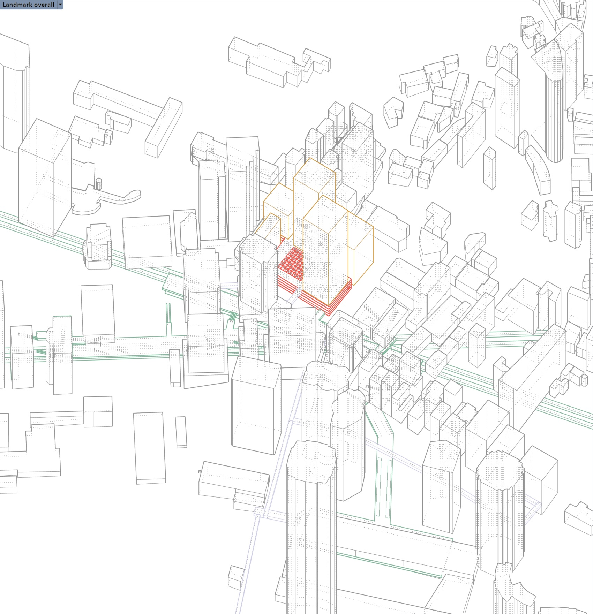

Heterotopia describes spaces that contradict or juxtapose locations found in the existing urban context (Foucault, 1984). They are basic building blocks throughout the city that change their role through use and time, becoming physical and figurative central spaces for societies. We advance the concept of heterotopia by focusing on atriums, as the unit of analysis, which is different from previous work that focused on traditional spatial types such as single buildings or outdoor public spaces. 

Competition for space within the city favors profitable land uses, such as commercial or residential development. As private developments grow in size and scale, space dedicated to the public realm becomes limited and often lacking for the population. The shift away from traditional forms of open and public spaces such as the civic plaza, the Greek agora, and the city square is the physical representation of the change in society's social, political, and economic values. Privately owned public space (POPS) became one of the solutions to create hybrid spaces that offer civic and public facilities on private land. Privately owned open spaces sparked a repertoire of research soon after discussing how the public use and perceives POPS. Unlike previous research that focused on the level of publicness of POPS, we aim to explore the role of atriums within the high-density urban context through a built environment and social aspect.

We are interested in knowing _Are atriums central devices for interior urbanism in high-density cities?_
1. What spatial elements make atriums different from other internal spaces?
2. What are the ways atriums are used?

### Project Outputs

- [placeholder]( "working paper")

_This project is funded by HKU Presidential PhD Scholarship, (2022.09-2026.09)._ 
{style="color: grey"}