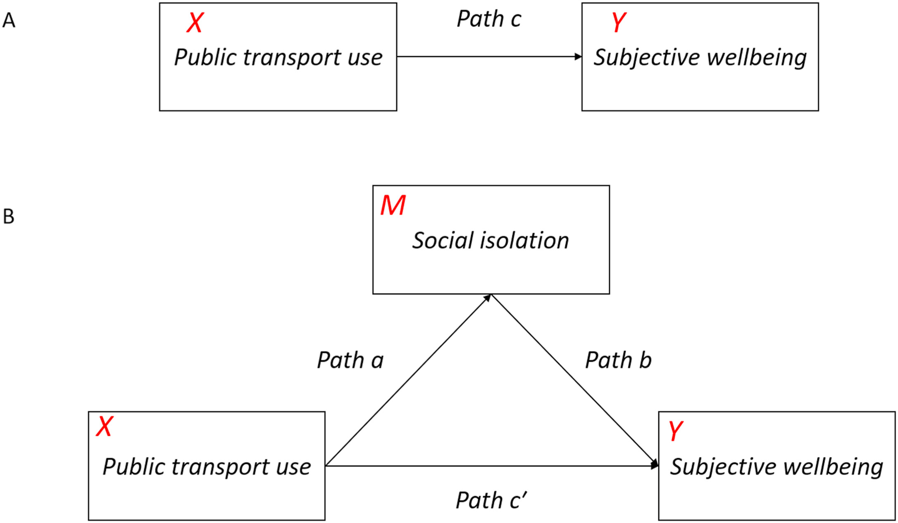

Being socially connected is critical for later life. As travel is essential for most social interactions, older adults can better engage in social activities and maintain supportive social relationships by increasing public transport use. In transit-oriented cities such as Hong Kong, older people benefit from the well-developed transport system – they can still maintain high mobility rates in their later lives. However, there is a mismatch between metro development and the travel needs of older people. Their favourite travel, the public bus, has been continuedly reduced or adjusted with the expansion of the metro system. This may discourage them from staying active, connected and healthy.

Social isolation is about older people's social network and their subjective feelings of loneliness. An increase in social networks and a reduction in perceived loneliness might benefit from supportive public transport options (e.g., more buses around), impacting wellbeing. However, we know little about the effect of social isolation on the relationship between the available public transport mode choice and the wellbeing of older people in Hong Kong.

Using the metro and elderly health baseline data, we provide empirical evidence on the mediating effects of social network and loneliness of older people on the relationship between their public transport options and wellbeing.

### Project Outputs

- [placeholder]( "academic publication")

_This project is funded by the HKU Seed Fund for Basic Research, **Reshaping Ties to Urban Environment in Later Life: A Qualitative Study Exploring the Social Wellbeing Impacts of a New Metro Line** (2022.07-2025.07, 102,500HKD)._ 
{style="color: grey"}