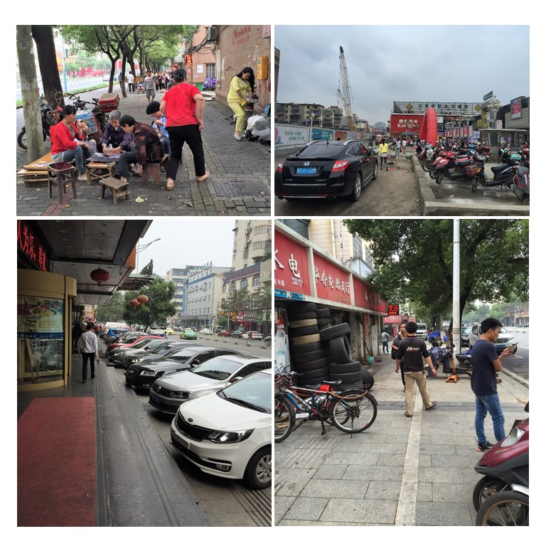
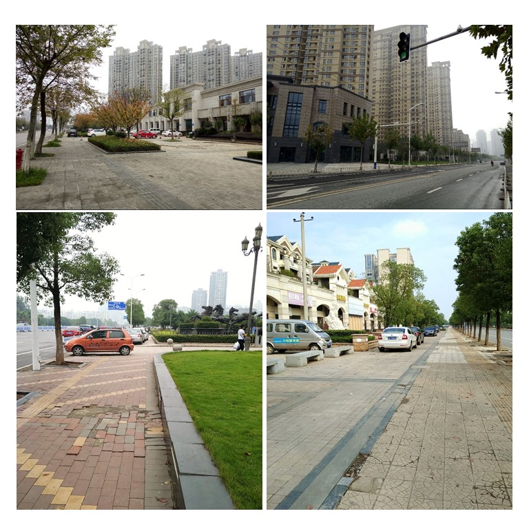

A walking-friendly environment can encourage pedestrian access and increase metro ridership; therefore, it should be carefully designed around the stations. Despite this, urban rail transit development is not always accompanied by walkable station surroundings. This issue deserves particular attention in developing countries such as China, which is experiencing rapid metro development and has abundant gated communities in building around stations, in both old neighbourhoods and newly sprawled areas. 

Our study shows that the development-oriented approach that prioritises land value increase has paid little attention to providing walking-friendly designs in station surroundings. Together with gated community development, the development-oriented transit has moved away from established strategic thinking on urban rail transit planning and sustainable city building. 

China’s metro systems will shape urban growth, development, economy and society for many decades to come. Re-engineering walking environments around stations will help increase transit ridership and transit-related property value in short-term and encourage healthier lifestyles and active travel in the long run. 

#### Walking to the metro in old neighbourhoods

#### Walking to the metro in newly designed areas

### Project Outputs

- [Objective assessment of station approach routes: development and reliability of an audit for walking environments around metro stations in China]( "academic publication")
- [How do metro stations integrate with walking environments? Results from walking access within three types of built environment in Beijing]( "academic publication")

_This project is funded by the National Natural Science Foundation of China (NSFC), **Natural experimental study of impacts of urban rail transit on sustainable travel in a medium-sized Chinese city** (2016.01-2020.04)._ 
{style="color: grey"}