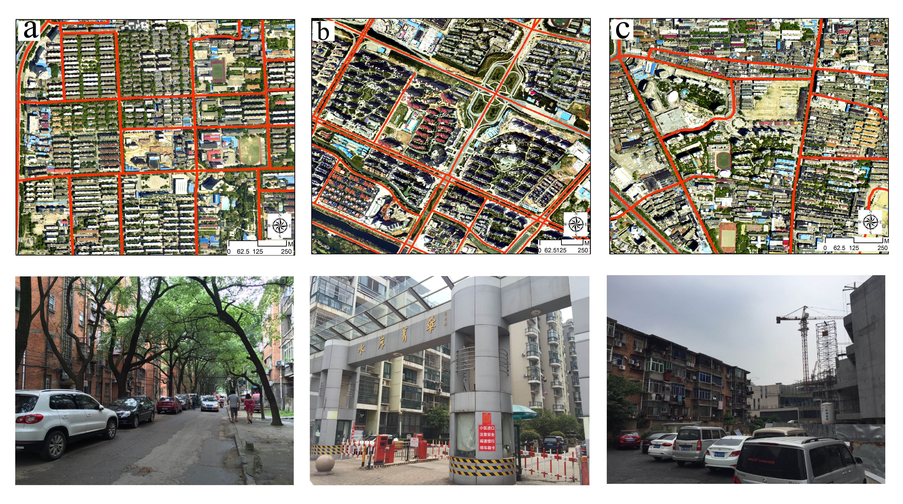
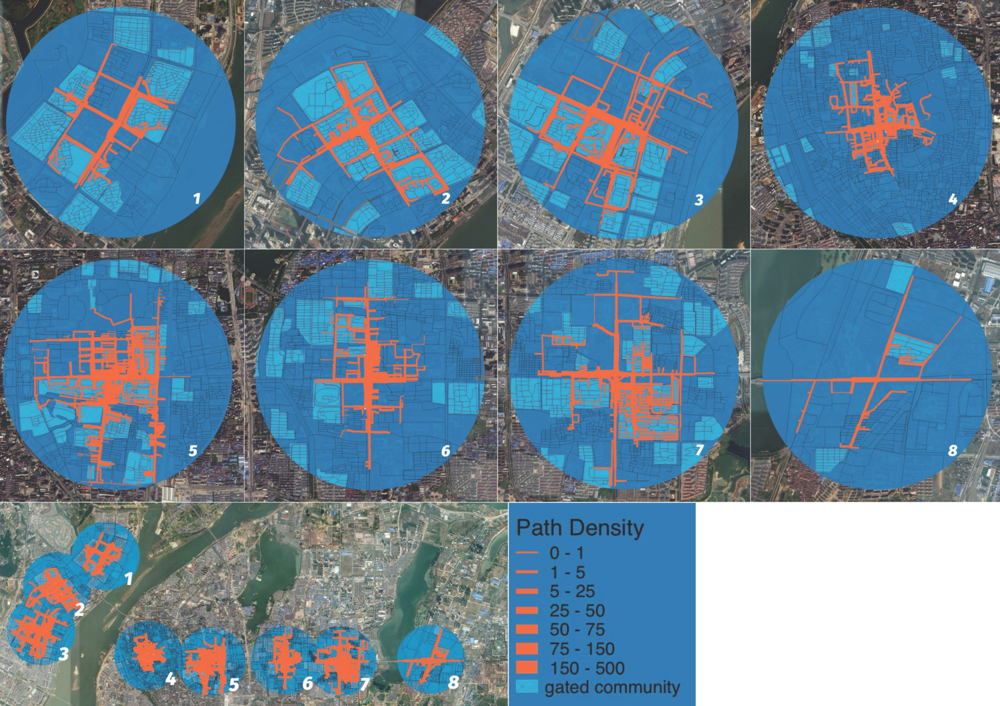

Chinese cities are the leader in building gated communities. After three-decade expansions, a recent policy is seeking to open them. We use permeability analysis to explore the ‘what if?’ question posed by the policy: what if gated communities became permeable? We asked the question in respect of non-motorised access, not for cars as the ungating policy implied. Nanchang, a medium-sized Chinese city with over 600 large gated communities, was the study area. We constructed a bespoke complete pedestrian network, for the permeability modelling. The ungated pedestrian network is 18 times longer than the gated road network. We offer the analysis to urban scholars, planners and governments by way of a quantified simulation. 

In terms of practical implementation, however, opening up all of a city’s gated communities would involve high political costs and potential compensation payments so it seems prudent to prioritise the ungating interventions which might yield the greatest benefits. The current study suggests that careful targeting of a sub-set of gated communities in station catchment areas for opening up and re-zoning with smaller blocks, or with pedestrian permeable larger blocks, will help maximise the benefits of metro station development (that has been extensively built), by deduction, such as promoting public transport use and increasing population health - more walking and cycling, more economically viable cities - greater pedestrian footfall concentrations, and a sustainable future.

### Project Outputs

- [Un-gating the cities: A permeability perspective]( "academic publication")
- [Unravelling the impact of street network structure and gated community layout in development-oriented transit design]( "academic publication")

_This project is funded by the National Natural Science Foundation of China (NSFC), **Natural experimental study of impacts of urban rail transit on sustainable travel in a medium-sized Chinese city** (2016.01-2020.04)._ 
{style="color: grey"}