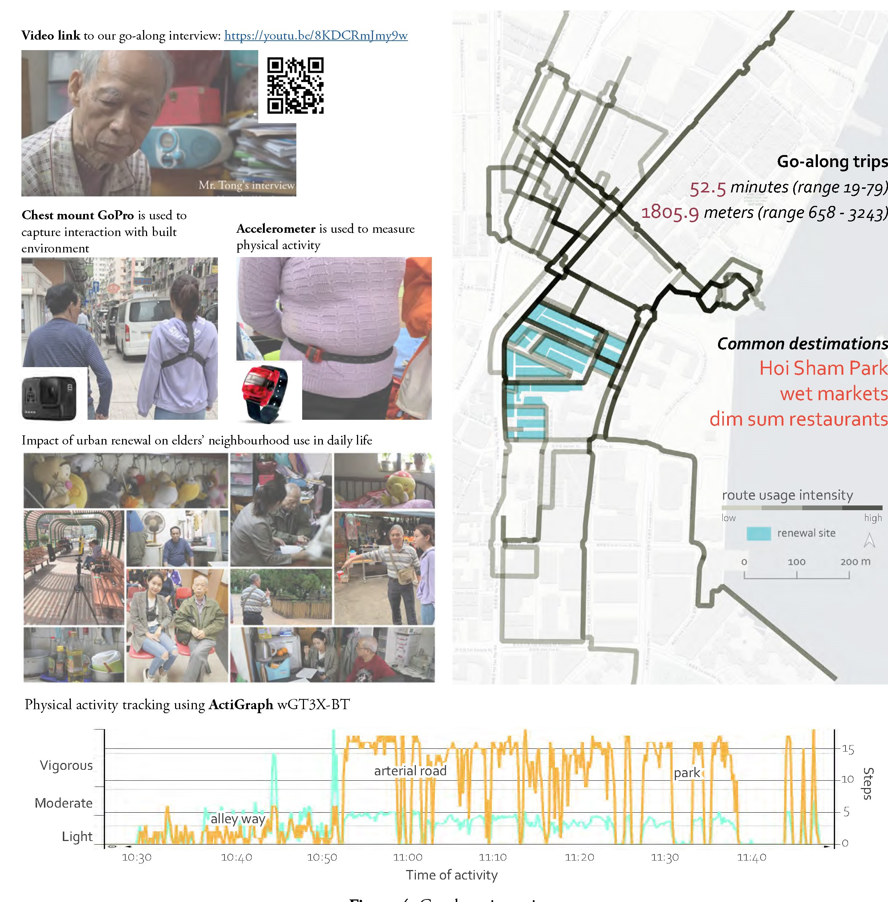

Hong Kong is facing a double-ageing challenge: the population is getting older, so are the buildings. Older people aged 65 or above were 17.9% in 2018 and are expected to increase to 31.9% in 2038; buildings aged over 50 years were 10,200 in 2018 and are estimated to increase 600 per year, reaching half of the city in 2046. Urban Renewal Authority (URA) was established in 2001 to deal with building ageing issues, such buildings are mainly in old urban neighbourhoods, where the ageing population is also concentrated.

Urban renewal in Hong Kong largely means urban redevelopment. Our research focus is thus on urban redevelopment of old neighbourhoods and its health impact on older people [^1]. In the past 20 years, URA implemented 62 projects, almost all (59) of which were redevelopment by demolishing low-rise buildings in old neighbourhoods and replacing with high-rises. 

Using a natural experiment, we will test URA’s hypothesis that urban renewal, and redevelopment specifically, can improve elderly health, focusing on mental health and wellbeing. Based on causal evidence, we can provide an objective basis to make renewal strategy more explicit and realistic about what urban renewal can achieve to improve the health of older people. 

We aim to collect practice-based evidence to enable future evidence-based practices to enhance ageing-in-place in Hong Kong. In addition, findings from the natural experiment will be of interest to other high-density double-ageing cities in the region, assisting in determining the wider societal impacts of future urban renewal and healthy ageing strategies. 



[^1] This project is supported by HKUrbanlabs (2021.07-2024.07)